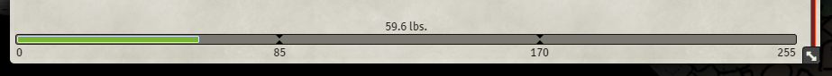
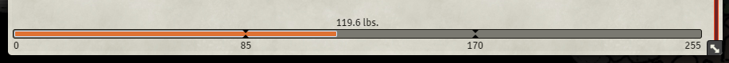
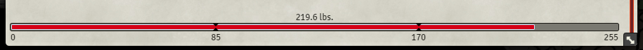
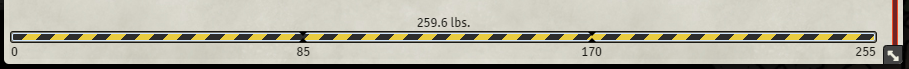
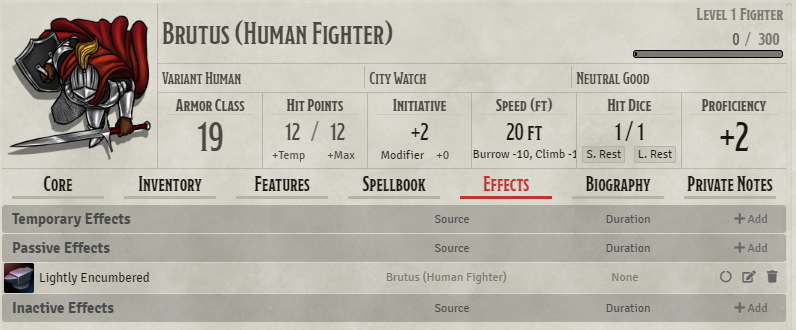
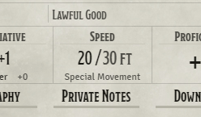
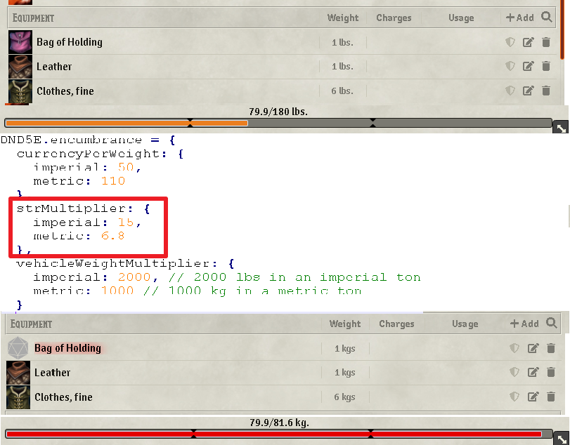

# Variant Encumbrance

 

[](https://forge-vtt.com/bazaar#package=variant-encumbrance-dnd5e) 


[](https://www.foundryvtt-hub.com/package/variant-encumbrance-dnd5e/)


A visual modification to player character sheets to better display the effects of the [Encumbrance variant ruleset in the PHB](https://5thsrd.org/rules/abilities/strength/).

- The rules for Lifting and Carrying are intentionally simple. Here is a variant if you are looking for more detailed rules for determining how a character is hindered by the weight of Equipment. When you use this variant, ignore the Strength column of the Armor table.
- If you carry weight in excess of 5 times your Strength score, you are encumbered, which means your speed drops by 10 feet.
- If you carry weight in excess of 10 times your Strength score, up to your maximum carrying Capacity, you are instead heavily encumbered, which means your speed drops by 20 feet and you have disadvantage on Ability Checks, Attack rolls, and Saving Throws that use Strength, Dexterity, or Constitution.


The effects of this module are currently purely visual, although restricting movement and applying the negative effects of encumbrance are applied with the new active effect mechanism.

For D&D5e 1.4.2 and newer the system supports a core implementation of this encumbrance rule. The module should be synchronized with the core functionality, but this module will permit more customised rules for your weight calculations/thresholds and the speed penalties are integrated with active effect.

## NOTE: If you are a javascript developer and not a typescript developer, you can just use the javascript files under the dist folder


## Installation

It's always easiest to install modules from the in game add-on browser.

To install this module manually:

1.  Inside the Foundry "Configuration and Setup" screen, click "Add-on Modules"
2.  Click "Install Module"
3.  In the "Manifest URL" field, paste the following url:

`https://raw.githubusercontent.com/VanirDev/VariantEncumbrance/master/src/module.json`

4.  Click 'Install' and wait for installation to complete
5.  Don't forget to enable the module in game using the "Manage Module" button

### libWrapper

This module uses the [libWrapper](https://github.com/ruipin/fvtt-lib-wrapper) library for wrapping core methods. It is a hard dependency and it is recommended for the best experience and compatibility with other modules.

### socketLib

This module uses the [socketLib](https://github.com/manuelVo/foundryvtt-socketlib) library for wrapping core methods. It is a hard dependency and it is recommended for the best experience and compatibility with other modules.

### active-effect-manager-lib

This module uses the [active-effect-manager-lib](https://github.com/p4535992/foundryvtt-active-effect-manager-lib) library like a dependency. It is a hard dependency and it is recommended for the best experience and compatibility with other modules.

### midi-qol

This module uses the [midi-qol](https://gitlab.com/tposney/midi-qol/-/tree/master). It is a optional dependency but it is recommended for the best experience and compatibility with other modules.

**NOTE: If "midiqol" is deactivated or not present, the active effects will apply only the speed reduction without the variations of advantage and disadvantage typical of the rule**

## Known Issue

- Due to the million variations of the various use cases that I have to take into account the most attentive players may notice a slowdown which is logical if you think I have to redo the checks and refresh the flags every time it is inserted, updated, deleted, revised , edited an object with weight. You need someone more Expert than me to handle this, but i still think to have done a good job with the handling of the use cases.
- Limitation on some character sheet, open a issue and i'll try to make a fix.
- Is not full synchronized with DAE in favor of the standard active effects mechanism. but you can still use dae on the active effect.
- I have not found the time to fully test for the vehicle sheet so any feedback is more than welcome, seem to work anyway

## Compatibility

 
 
 
 


### Character Sheets compatibility

* D&D5e Default Character Sheet

* [Sky's Alternate 5th Edition Dungeons & Dragons Sheet](https://github.com/Sky-Captain-13/foundry/tree/master/alt5e) Seem to work
* [Tidy5e Sheet (Both light & dark themes)](https://github.com/sdenec/tidy5e-sheet) Seem to work
* [Compact DnDBeyond-like 5e Character Sheet](https://github.com/ElfFriend-DnD/foundryvtt-compactBeyond5eSheet) Active effect work, but there is no visual bar , the values of the weight are synchronized with the system core
* [DNDBeyond Character Sheet for 5E](https://github.com/jopeek/fvtt-dndbeyond-character-sheet) Active effect work, but there is no visual bar , the values of the weight are synchronized with the system core

### Other Modules Compatability

* [Inventory +](https://github.com/p4535992/inventory-plus) version 0.4.0
* [Dynamic Active Effects](https://gitlab.com/tposney/dae)
* [DFreds Convenient Effects](https://github.com/DFreds/dfreds-convenient-effects/) version 1.8.5
* [Item Collection/Item Containers](https://foundryvtt.com/packages/itemcollection) version 1.8.13
* [DragonFlagon Quality of Life, Vehicle Cargo Capacity Unit Feature](https://github.com/flamewave000/dragonflagon-fvtt/blob/master/df-qol/README.md#vehicle-cargo-capacity-unit) version 1.6.0

**I highly recommend avoiding module [Inventory +](https://github.com/p4535992/inventory-plus) in favor of the module [Item Collection/Item Containers](https://foundryvtt.com/packages/itemcollection)**

<!--
<details>
  <summary>Click to Expand</summary>
</details>
-->

## Features

### Redesigned weight bar






The default character weight bar has received a lick of paint, giving labels for all four weight thresholds. These thresholds are also reconfigurable in the settings, and will update the bar to display the new proportions.

#### Effect-based Speed Reduction with Active Effects





Your encumbrance status is automatically used to provide a modified speed value, taking your default character speed and modifying it by -10 and -20 for encumbered and heavily encumbered, and reducing to 0 when over encumbered. (For 0.1.5, the speed value must be separated by a space from its units).

### Character Size & Powerful Build (Optional)

_Powerful Build Feature: You count as one size larger when determining your carrying capacity and the weight you can push, drag, or lift._

Enabled by default, the module will modify your maximum carry weight according to your character's size, and whether you have the powerful build special trait. This feature can be disabled in the module settings. (Credit to [Eruestani](https://github.com/Eruestani) for implementing this).

### Item Weight Multipliers (Optional)

In the module settings, custom multipliers are available for unequipped, equipped, and proficiently equipped items. This was mainly added for my house rules, where equipped proficient items get a small weight reduction due to experience handling them, but this lends some flexibility to the system for anyone to use.

### Buttons header sheet for enable/disable the features of Variant Encumbrance (Weight Calculation and Active Effects) actor by actor

Add new buttons on the header sheet of the actors for choose when to avoid to add the Active Effect or weight calculation. To much bad feed back on the automatization of the AE, i hope  with this to help the community to find the best solution for the single individual

| Symbol Button Header Sheet  | Description  |
|:----:|:----:|
| | If you want to have the Varian Encumbrance Active Effects and Weight calculation features on your actor make sure to have the "weight" symbol on the header sheet (this is the default) |
|| If you don't  want to have the Varian Encumbrance Active Effects feature on your actor make sure to have the "balance" symbol on the header sheet. ATTENTION the weight calculation feature is still active|
|| If you don't  want to have the Variant Encumbrance Active Effects and Weight calculation features on your actor make sure to have the "feather" symbol on the header sheet. *The weight is not calculated anymore and remain frozen (unless the setting 'Use standard calculation weight of the dnd5e system' is set to true in that case the weight calculation rollback to the standard weight calculation of the system dnd5e)* |

Some preview:


**NOTE: from 0.6.11 the button are colored !!!**

### Fake the metric system calculation, but we using the imperial one

This feature is enabled with the module setitng _'Fake the metric system calculation, but we using the imperial one'_

**Use this only with the system setting 'Use Metric Weight Units' checked.** because that setting doesn't update the value in lbs. to kg. of the item so the calculation is 'visually wrong', with this setting set to true we use the same imperial encumbrance costants, and avoid the problem, but this is a patch not a solution, this is why there it was this module in the past https://github.com/HadaIonut/Foundry-mgl

The calculation should be correct, the metric values ​​2.5, 5, 7.5 are the official ones of the dnd5e system, the problem is that checking the metric system checkbox does not consequently update the item values ​​as we would expect _1lb = 0.45kg_ but remains _1lb = 1kg_ therefore an object that weighs 6lb will result in weighing 6kg and this gives the illusion of displacing the weight, the description clearly says so **Replaces all reference to lbs with kgs and updates the encumbrance calculations to use metric weight units.** where with reference we mean the label 'lbs' in 'kg' not the value .... this is done on purpose to avoid a massive update of the items, consequently it does not update the weight on the objects, you can also check with the module deactivated. However, I attach an image for clarity.



### Integration with System Bulk based on the rules from [Giffyglyph](https://www.giffyglyph.com/darkerdungeons/grimoire/4.0.0/en/active_inventory.html)

An active inventory manages items using inventory slots (storage capacity) and object bulk (carrying effort).
### Inventory slots

Inventory slots describe storage capacity—how much can a thing carry without being overwhelmed? One slot holds one small object—a potion bottle, a dagger, a loaf of bread, etc.

Anything that can hold, carry, or contain objects can make use of inventory slots—for example:

- Creatures use slots to describe how much they can carry before they're encumbered.
- Containers use slots to describe how much they can store before they're full.
- Buildings use slots to describe how much free space they have in their rooms.
- Vehicles use slots to describe how much they can transport before they can't move.

### Your Inventory

Your inventory capacity depends on your creature size and strength modifier—the bigger and stronger you are, the more inventory slots you have.

As your size increases, so too does your bulk—a larger creature takes more effort to carry. Your bulk equals the larger of either a) your minimum bulk or b) the total bulk of everything in your inventory.

**Creature Inventory**

| Creature Size | Inventory Slots | Minimum Bulk |
|:-------------:|:---------------:|:------------:|
| Tiny | 6 + STR | 5 |
| Small | 14 + STR | 10 |
| Medium | 18 + STR | 20 |
| Large | 22 + [ STR x 2 ] | 40 |
| Huge | 30 + [ STR x 4 ] | 80 |
| Gargantuan | 46 + [ STR x 8 ] | 160 |

Here we see three characters calculate their inventory:

- Valiant, a human cleric, is a medium-sized creature (18 slots) with +2 STR (+2 slots). He has a total of 20 inventory slots, and occupies a minimum of 20 slots when carried.
- Crackle, a kobold wizard, is a small creature (14 slots) with −1 STR (−1 slot). She has 13 inventory slots and occupies a minimum of 10 slots.
- Brakken, a goliath barbarian, is a medium-sized creature with _Powerful Build_ (22 slots) and +3 STR (+6 slots). She has 28 inventory slots and occupies a minimum of 20 slots when carried.

#### More details about the calculation can be found [here](https://www.giffyglyph.com/darkerdungeons/grimoire/4.0.0/en/active_inventory.html)

### Bulk

Objects use bulk to describe how many inventory slots they fill—the bulkier the object, the more slots occupied.

Bulk represents the effort needed by a medium-sized creature to carry an object based on its size, weight, and shape—the more awkward or uncomfortable it is to hold an object, the higher its bulk.


### Buttons header sheet for enable/disable the features of Bulk (Weight Bulk Calculation and Active Effects Bulk) actor by actor

Add new buttons on the header sheet of the actors for choose when to avoid to add the Active Effect or weight calculation. To much bad feed back on the automatization of the AE, i hope  with this to help the community to find the best solution for the single individual

| Symbol Button Header Sheet  | Description  |
|:----:|:----:|
| | If you want to have the Varian Encumbrance Active Effects and Weight calculation features on your actor make sure to have the "bold" symbol on the header sheet (this is the default) |
|| If you don't  want to have the Varian Encumbrance Active Effects feature on your actor make sure to have the "balance" symbol on the header sheet. ATTENTION the weight calculation feature is still active|
|| If you don't  want to have the Variant Encumbrance Active Effects and Weight calculation features on your actor make sure to have the "feather" symbol on the header sheet. *The weight is not calculated anymore and remain frozen (unless the setting 'Use standard calculation weight of the dnd5e system' is set to true in that case the weight calculation rollback to the standard weight calculation of the system dnd5e)* |

### Variant Encumbrance Flag

Should you wish to integrate some of Variant Encumbrance's calculations into your own modules, there is now a flag which stores the actor's encumbrance tier, weight, and modified speed. Encumbrance tier is presented as 0, 1, 2, 3, as Unencumbered, Encumbered, Heavily Encumbered, Over Encumbered, respectively.

```javascript
variant-encumbrance-dnd5e:
{
  burrow: 0,
  climb: 0,
  fly: 0,
  swim: 0,
  walk: 30,
  data: {
    totalWeight: 0,
    totalWeightToDisplay: 0,
    lightMax: 50,
    mediumMax: 100,
    heavyMax: 150,
    encumbranceTier: 0,
    speedDecrease: 0,
    unit: 'lbs',
    encumbrance: {
        value: 150,
        max: 100,
        pct: 200,
        encumbered: true,
    }
  },
  bulk: {
    totalWeight: 0,
    totalWeightToDisplay: 0,
    lightMax: 50,
    mediumMax: 100,
    heavyMax: 150,
    encumbranceTier: 0,
    speedDecrease: 0,
    unit: 'bulk',
    encumbrance: {
        value: 150,
        max: 100,
        pct: 200,
        encumbered: true,
    },
    inventorySlot: 60,
    minimumBulk: 2;
  },
  enabledae: true,
  enabledwe: true,
  enabledaebulk: false,
  enabledwebulk: true,
}
```

- **burrow:** the value in units for the burrow movement get from property `actor.data.data.attributes.movement.burrow`.
- **climb:** the value in units for the climb movement get from property `actor.data.data.attributes.movement.climb`.
- **fly:** the value in units for the fly movement get from property `actor.data.data.attributes.movement.fly`.
- **swim:** the value in units for the swim movement get from property `actor.data.data.attributes.movement.swim`.
- **walk:** the value in units for the walk movement get from property `actor.data.data.attributes.movement.walk`.
- **totalWeight:** the 'real' total weight synced with the core system of dnd5e.
- **totalWeightToDisplay:** the 'fake'  total weight not synced with the core system of dnd5e, is used for manage on a display level feature from other module like "Vehicle Cargo Capacity Unit" from the module 'DF QUALITY OF LIFE'.
- **lightMax:** the weight value for pass from 'unencumbered' to 'encumbered' and back.
- **mediumMax:** the weight value for pass from 'encumbered' to 'heavily encumbered' and back.
- **heavyMax:** the weight value for pass from 'heavily encumbered' to 'overburdened' and back.
- **encumbranceTier:** the number given the current tier applied don the actor 
    - 0 = Unencumbered
    - 1 = Encumbered
    - 2 = Heavily Encumbered
    - 3 = Over Encumbered (Overburdened)
- **speedDecrease:** the value in units of the decreased movement (this change if the metric system is active or not).
- **unit:** the label applied to the unit weight, just a visual effect (default is lbs. on metric system is kg.).
- **encumbrance:** the representation of the standard dnd5e system encumbrance data useful for integration between modules.
- **inventorySlot:** describe storage capacity—how much can a thing carry without being overwhelmed? One slot holds one small object—a potion bottle, a dagger, a loaf of bread, etc.
- **minimumBulk:** the calculated minimum bulk fir the current actor
- **enabledae:** if true it's mean on the actor is applied the management of the active effects of the weight from the module. _NOTE: if you set true this is better to set to false 'enabledwe'_
- **enabledwe:** if true it's mean on the actor is applied the calculation of the weight from the module.
- **enabledaebulk:** if true it's mean on the actor is applied the system bulk the management of the active effects of the weight from the module. _NOTE: if you set true this is better to set to false 'enabledwe'_
- **enabledwebulk:** if true it's mean on the actor is applied the system bulk and the calculation of the weight from the module.

# Settings

| Name | Hint | Default Value | More Details |
|:-----|:-----|:-------------:|:-------------|
|Use Variant Encumbrance with specific type of actor | Use for example the following type of actors (e.g. character, npc, ecc. separate by character ','), remember is case sensitive. | character,vehicle | A list of actor type where the module is enabled, if empty is like disable the module |
| Fake the metric system calculation, but we using the imperial one | Use this only with the system setting 'Use Metric Weight Units' checked. Because that setting doesn't update the value in lbs. to kg. of the item the calculation is 'visually wrong', with this setting set to true we use the same imperial encumbrance constants, and avoid the problem, but this is a patch not a solution, this is why there it was this module in the past https://github.com/HadaIonut/Foundry-mgl | false | THIS WILL MADE IGNORE THE FOLLOWING MODULE SETTINGS 'Unencumbered Strength Multiplier (Metric System)', 'Encumbered Strength Multiplier (Metric System)' and 'Heavily Encumbered (old Strength Multiplier) (Metric System)' |
|Unencumbered Strength Multiplier| Multiplier used to calculate maximum carrying weight before being encumbered from the strength ability score.|5||
|Unencumbered Strength Multiplier (Metric System)| Multiplier used to calculate maximum carrying weight before being encumbered from the strength ability score (Metric System).|2.5||
|Encumbered Strength Multiplier| Multiplier used to calculate maximum carrying weight before being heavily encumbered from the strength ability score.|10||
|Encumbered Strength Multiplier (Metric System)| Multiplier used to calculate maximum carrying weight before being heavily encumbered from the strength ability score (Metric System).|5||
|Heavily Encumbered (old Strength Multiplier)| Multiplier used to calculate maximum carrying weight from the strength ability score.|15||
|Heavily Encumbered (old Strength Multiplier) (Metric System)| Multiplier used to calculate maximum carrying weight from the strength ability score (Metric System).|7.5||
|Enable or disable the strength multiplier feature| Enable or disable the strength multiplier feature.|false|I DON'T RECOMMENDED it, this will multiply the carriage value with CONFIG.DND5E.encumbrance.strMultiplier.imperial/CONFIG.DND5E.encumbrance.strMultiplier.metric value, USUALLY YOU DON'T NEED THIS because the module already do this with the setting "Heavily Encumbered" multiplier|
|Strength Multiplier| Work only with strength multiplier feature enabled. Multiplier used to calculate maximum carrying weight from the strength ability score.|15|Usually you never need this except for some homebrew rule|
|Strength Multiplier (Metric System)| Multiplier used to calculate maximum carrying weight from the strength ability score (Metric System).|7.5|Usually you never need this except for some homebrew rule|
|Variant Encumbrance Speed Penalties| Enable automatic speed penalties from carry weight.|true||
|Unequipped Item Weight Multiplier| Multiplier for items when not equipped.|1||
|Equipped Item Weight Multiplier| Multiplier for items when equipped, can be used to reduce effective weight for armour and weapons.|1||
|Proficient Equipped Item Weight Multiplier| Multiplier for proficient items when equipped, can be used to reduce effective weight for armour and weapons.|1||
|Currency Per Weight Unit| Define the number of coins required to equal 1 unit of weight.|50||
|Currency Per Weight Unit (Metric System)| Define the number of coins required to equal 1 unit of weight (Metric System).|110||
|Vehicle weights Weight Multiplier, lbs in an imperial ton| Vehicle weights are an order of magnitude greater, Multiplier for vehicles.|2000||
|Vehicle weights Weight Multiplier, kg in a metric ton (Metric System)| Vehicle weights are an order of magnitude greater, Multiplier for vehicles (Metric System).|1000||
|Variant Encumbrance Size Modifiers| Enable multipliers from creature size.|true||
|Weight Units| Units displayed in the encumbrance bar (just graphics).|lbs.||
|Weight Units (Metric System)| Units displayed in the encumbrance bar (just graphics) (Metric System).|kg.||
|Lightly Encumbered Speed Decrease| The number of speed units subtracted when lightly encumbered, default is 10.|10||
|Lightly Encumbered Speed Decrease (Metric System)| The number of speed units subtracted when lightly encumbered, default is 3.|3||
|Encumbered Speed Decrease| The number of speed units subtracted when heavily encumbered, default is 20.|20||
|Encumbered Speed Decrease (Metric System)| The number of speed units subtracted when heavily encumbered, default is 6.|6||
|Enable pre check encumbrance tier| I DON'T RECOMMENDED it, but does anyone seem to use this strange rule? If true the add/remove of the AE is launched only when there is a change on the value level of the tier so the refresh is ignored when add/remove/update item|false||
|Enable/Disable the feature for applying the variant encumbrance active effects for specific actor| If true add on the header sheet of the actor a button visible only to GM for enable/disable the active effects feature, by default the feature is disabled (the flag is false) for performance issues|true||
|Remove label from buttons on the header character sheet| Remove label from buttons on the header character sheet, Useful for little screen and mobile, by default is true|true||
|Use standard calculation weight of the dnd5e system| I DON'T RECOMMENDED it, but some people seem to lose their mind for 2s instead of 1s on the calculation weight ???, you will lose all the benefit from the others feature like Equipped, Unequipped, Proficient Equipped, Inventory +, Item container, ecc., but hey !! you got the 1 sec you miss.|false||
|Use equipped/unequipped feature of the ItemCollection/Item Container module for the backpack| I DON'T RECOMMENDED it, the only difference (only for item container) is \"Item container\" module set 0 if unequipped, the \"variant encumbrance\" get the value from the module setting by default 1 if unequipped, and now i remember the calculation not make sense for some people because there are two behaviour for the equipped and unequipped items if they are item container or standard item. Bags can be unequipped by players or GM, so that their reported weight drops to 0 in your inventory (only bags with a capacity other than 0 can be unequipped)|false|This make sense only with [Item Collection/Item Containers](https://foundryvtt.com/packages/itemcollection) installed and active|
|[DEPRECATED] Disable the socketLib feature integration|This is usually useful only for avoid a socket collision with other modules|false||
|Enable Bulk system|Enable integration with the Bulk System explained here: https://www.giffyglyph.com/darkerdungeons/grimoire/4.0.0/en/active_inventory.html|false||
|Weight Units (Bulk System)|Units displayed in the encumbrance bar (just graphics) (Bulk System). Default is 'bulk'|bulk||
|Encumbered Speed Decrease (Bulk System)|The number of speed units multiply when heavily encumbered (Bulk System), default is '0.5'.|0.5||
|Automatic apply suggested bulk|WARNING: THIS IS DANGEROUS, IT WILL UPDATE THE BULK DATA ON EVERY ITEM BEEN RENDERED IF THE BULK VALUE IS 0. This is usually save time if you don't want to manually set every item (the advisable way)|false||
|Remove standard encumbrance bar from the character sheet| If enabled it will hide the standard bar of encumbrance, is useful only for people using the bulk bar and do not want to see two graphic bars|false|
|Do Not increase weight by quantity for no ammunition item| This is a homebrew rule, for non-ammunition items don't increase weight by quantity (so 5 potions = 1 item weight for example). ATTENTION: If the module 'Variant Encumbrance' is present and active this feature is disabled by default if the module settings 'Feature: Integration with Variant Encumbrance' is enabled.|false|
|Debug|Enable debug messages useful for check issues|false||

# API

### game.modules.get('variant-encumbrance-dnd5e').api.calculateWeightOnActorFromId(actorIdOrName:string, ignoreCurrency:boolean) ⇒ <code>EncumbranceData</code>

Calculate the weight on the actor with all the filters applied.

**Returns**: <code>EncumbranceData</code> - A EncumbranceData object

| Param | Type | Description | Default |
| --- | --- | --- | --- |
| actorIdOrName | <code>string</code> | The actor reference by id or name | <code>undefined</code> |

**Example**:
`game.modules.get('variant-encumbrance-dnd5e').api.calculateWeightOnActorFromId('Pippo')`

### game.modules.get('variant-encumbrance-dnd5e').api.calculateWeightOnTokenFromId(tokenIdOrName:string, ignoreCurrency:boolean) ⇒ <code>EncumbranceData</code>

Calculate the weight on the actor with all the filters applied.

**Returns**: <code>EncumbranceData</code> - A EncumbranceData object

| Param | Type | Description | Default |
| --- | --- | --- | --- |
| tokenIdOrName | <code>string</code> | The token reference by id or name | <code>undefined</code> |

**Example**:
`game.modules.get('variant-encumbrance-dnd5e').api.calculateWeightOnTokenFromId('Pippo')`

### game.modules.get('variant-encumbrance-dnd5e').api.calculateWeightOnActor(actor:Actor, ignoreCurrency:boolean):EncumbranceData ⇒ <code>EncumbranceData</code>

Calculate the weight on the actor with all the filters applied.

**Returns**: <code>EncumbranceData</code> - A EncumbranceData object

| Param | Type | Description | Default |
| --- | --- | --- | --- |
| actor | <code>Actor</code> | The actor object | <code>undefined</code> |

**Example**:
`game.modules.get('variant-encumbrance-dnd5e').api.calculateWeightOnActor(actor)`

### game.modules.get('variant-encumbrance-dnd5e').api.calculateBulkOnActorFromId(actorIdOrName:string, ignoreCurrency:boolean) ⇒ <code>EncumbranceData</code>

Calculate the bulk on the actor with all the filters applied.

**Returns**: <code>EncumbranceData</code> - A EncumbranceData object

| Param | Type | Description | Default |
| --- | --- | --- | --- |
| actorIdOrName | <code>string</code> | The actor reference by id or name | <code>undefined</code> |

**Example**:
`game.modules.get('variant-encumbrance-dnd5e').api.calculateBulkOnActorFromId('Pippo')`

### game.modules.get('variant-encumbrance-dnd5e').api.calculateBulkOnTokenFromId(tokenIdOrName:string, ignoreCurrency:boolean) ⇒ <code>EncumbranceData</code>

Calculate the bulk on the actor with all the filters applied.

**Returns**: <code>EncumbranceData</code> - A EncumbranceData object

| Param | Type | Description | Default |
| --- | --- | --- | --- |
| tokenIdOrName | <code>string</code> | The token reference by id or name | <code>undefined</code> |

**Example**:
`game.modules.get('variant-encumbrance-dnd5e').api.calculateBulkOnTokenFromId('Pippo')`

### game.modules.get('variant-encumbrance-dnd5e').api.calculateBulkOnActor(actor:Actor, ignoreCurrency:boolean):EncumbranceData ⇒ <code>EncumbranceData</code>

Calculate the bulk on the actor with all the filters applied.

**Returns**: <code>EncumbranceData</code> - A EncumbranceData object

| Param | Type | Description | Default |
| --- | --- | --- | --- |
| actor | <code>Actor</code> | The actor object | <code>undefined</code> |

**Example**:
`game.modules.get('variant-encumbrance-dnd5e').api.calculateBulkOnActor(actor)`

### game.modules.get('variant-encumbrance-dnd5e').api.convertLbToBulk(weight: number):number ⇒ <code>number</code>

Convert weight to bulk

**Returns**: <code>EncumbranceData</code> - A EncumbranceData object

| Param | Type | Description | Default |
| --- | --- | --- | --- |
| weight | <code>number</code> | The weight | <code>undefined</code> |

**Example**:
`game.modules.get('variant-encumbrance-dnd5e').api.convertLbToBulk(weight)`

### game.modules.get('variant-encumbrance-dnd5e').api.calculateWeightOnActorWithItems(actor: Actor, items:Item[]): EncumbranceData | undefined

### game.modules.get('variant-encumbrance-dnd5e').api.calculateBulkOnActorWithItems(actor: Actor, items:Item[]): EncumbranceBulkData | undefined

### game.modules.get('variant-encumbrance-dnd5e').api.calculateWeightOnActorWithItemsNoInventoryPlus(actor: Actor, items:Item[]): EncumbranceData | undefined

### game.modules.get('variant-encumbrance-dnd5e').api.calculateBulkOnActorWithItemsNoInventoryPlus(actor: Actor, items:Item[]): EncumbranceBulkData | undefined

## Models

### EncumbranceData

Here the _EncumbranceData_ structure:

```
{
  totalWeight: number,
  totalWeightToDisplay: number,
  lightMax: number,
  mediumMax: number,
  heavyMax: number,
  encumbranceTier: number,
  speedDecrease: number,
  unit: string,
  encumbrance:EncumbranceDnd5e;
}
```

### EncumbranceDnd5e

Here the _EncumbranceDataDnd5e_ structure:

```
{
  value: number;
  max: number;
  pct: number;
  encumbered?: boolean; //Vehicle not have this
}
```

### EncumbranceBulkData

Here the _EncumbranceBulkData_ structure extends _EncumbranceData_:

```
{
  totalWeight: number,
  totalWeightToDisplay: number,
  lightMax: number,
  mediumMax: number,
  heavyMax: number,
  encumbranceTier: number,
  speedDecrease: number,
  unit: string,
  encumbrance:EncumbranceDnd5e;
  inventorySlot: number;
  minimumBulk: number;
}
```

# Build

## Install all packages

```bash
npm install
```
## npm build scripts

### build

will build the code and copy all necessary assets into the dist folder and make a symlink to install the result into your foundry data; create a
`foundryconfig.json` file with your Foundry Data path.

```json
{
  "dataPath": "~/.local/share/FoundryVTT/"
}
```

`build` will build and set up a symlink between `dist` and your `dataPath`.

```bash
npm run-script build
```

### NOTE:

You don't need to build the `foundryconfig.json` file you can just copy the content of the `dist` folder on the module folder under `modules` of Foundry

### build:watch

`build:watch` will build and watch for changes, rebuilding automatically.

```bash
npm run-script build:watch
```

### clean

`clean` will remove all contents in the dist folder (but keeps the link from build:install).

```bash
npm run-script clean
```
### lint and lintfix

`lint` launch the eslint process based on the configuration [here](./.eslintrc)

```bash
npm run-script lint
```

`lintfix` launch the eslint process with the fix argument

```bash
npm run-script lintfix
```

### prettier-format

`prettier-format` launch the prettier plugin based on the configuration [here](./.prettierrc)

```bash
npm run-script prettier-format
```

### package

`package` generates a zip file containing the contents of the dist folder generated previously with the `build` command. Useful for those who want to manually load the module or want to create their own release

```bash
npm run-script package
```

## [Changelog](./changelog.md)

## Issues

Any issues, bugs, or feature requests are always welcome to be reported directly to the [Issue Tracker](https://github.com/VanirDev/VariantEncumbrance/issues ), or using the [Bug Reporter Module](https://foundryvtt.com/packages/bug-reporter/).

## License

This package is under an [MIT license](LICENSE) and the [Foundry Virtual Tabletop Limited License Agreement for module development](https://foundryvtt.com/article/license/).

## Acknowledgements

Bootstrapped with League of Extraordinary FoundryVTT Developers  [foundry-vtt-types](https://github.com/League-of-Foundry-Developers/foundry-vtt-types).

Mad props to the 'League of Extraordinary FoundryVTT Developers' community which helped me figure out a lot.
